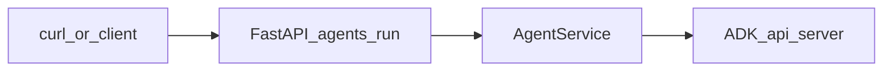

# Manual agent flow checklist

**Goal:** Validate [`app/services/agent_service.py`](../../app/services/agent_service.py) `AgentService` end-to-end (live ADK + httpx), using **`POST /agents/run`** as the integration harness (same path as [`app/api/agents_routes.py`](../../app/api/agents_routes.py)).



---

## AgentService coverage matrix

| Method | Exercised by | Assert |
| --- | --- | --- |
| `create_session()` | Every successful `/agents/run` (all `mode` values) | No 5xx before run/stream; ADK session response includes string `id` (opaque to curl; infer from success). |
| `run_text()` | `mode: "text"` | HTTP 200; JSON has `"text"` string (may be empty if ADK returns a non-list body; see service code). |
| `run_json()` | `mode: "json"` | HTTP 200; `{"status":"success"\|"error","data":{...}}`; on bad agent JSON or upstream `httpx.HTTPError`, `status` is `error` and `data` is `{}` (handler does not raise). |
| `stream_run_sse()` | `mode: "sse"` | HTTP 200; `Content-Type: text/event-stream`; non-empty stream or clean end per ADK; watch `ADK_TIMEOUT_SECONDS`. |
| `_run_payload` / `_sse_run_payload` | Indirectly | Successful `text` / `sse` calls imply ADK accepted the POST body shape. |

**Helpers** (`_text_from_event`, `_final_text_from_events`, `_parse_agent_json_object`, `envelope_success` / `envelope_error`): covered indirectly via `run_text` / `run_json` results—no need to import private symbols.

---

## Environment (authoritative: `app/config.py`)

| Setting field | Env variable (typical) | Default |
| --- | --- | --- |
| `database_url` | `DATABASE_URL` | (required) |
| `adk_base_url` | `ADK_BASE_URL` | `http://127.0.0.1:8001` |
| `adk_app_name` | `ADK_APP_NAME` | `app` |
| `adk_timeout_seconds` | `ADK_TIMEOUT_SECONDS` | `300` |

**`.env.example` drift:** it still documents `AGENT_RUN_URL`, `AGENT_APP_NAME`, `AGENT_HTTP_TIMEOUT_SECONDS`, etc. Those names are **not** loaded by `Settings` today—use the table above when wiring `.env`.

**Agents route gate:** there is **no** `agent_smoke_enabled` flag in current settings; `/agents/run` is available whenever the API process is up. Treat that as a **security** consideration (see below).

---

## Step A — ADK (`agent-normalizer`)

- [ ] **Check** ADK is reachable (adjust host/port if `ADK_BASE_URL` differs):

  ```bash
  curl -sS -o /dev/null -w "%{http_code}\n" "${ADK_BASE_URL:-http://127.0.0.1:8001}/"
  ```

  Any non-connection-refused response is enough to proceed (exact status code depends on ADK version).

- [ ] **If down:** in your **agent-normalizer** clone, start the API server per that repo’s Makefile (see comment in `agent_service.py`: typically `make api`). Keep **port** aligned with `ADK_BASE_URL`.

---

## Step B — Backend API

- [ ] Export `DATABASE_URL` (and optional `ADK_*` overrides) in the shell or `.env` next to the app.

- [ ] From repo root `backend/`:

  ```bash
  make dev
  ```

  Default API: `http://127.0.0.1:8000` (override with `make dev PORT=...`).

---

## Step C — CLI smoke (`curl`)

Replace `8000` if you changed `PORT`.

### `run_text` (`mode: "text"`)

```bash
curl -sS -X POST "http://127.0.0.1:8000/agents/run" \
  -H "Content-Type: application/json" \
  -d '{"user_id":"smoke_user","prompt":"Reply with one short sentence.","mode":"text"}'
```

- [ ] HTTP **200**; body includes `"text"`.

### `run_json` (`mode: "json"`)

Use a prompt that forces a **single JSON object** from the model (otherwise expect `status: "error"`).

```bash
curl -sS -X POST "http://127.0.0.1:8000/agents/run" \
  -H "Content-Type: application/json" \
  -d '{"user_id":"smoke_user","prompt":"Reply with exactly this JSON and nothing else: {\"ok\":true}","mode":"json"}'
```

- [ ] HTTP **200**; `status` is `success` or `error`; `data` is an object.

**Negative check (optional):** same call with a prompt that returns plain text or an array—expect `status: "error"`, `data: {}`.

### `stream_run_sse` (`mode: "sse"`)

```bash
curl -sS -N -X POST "http://127.0.0.1:8000/agents/run" \
  -H "Content-Type: application/json" \
  -d '{"user_id":"smoke_user","prompt":"Stream a few tokens.","mode":"sse"}'
```

- [ ] HTTP **200**; streaming body; cancel with Ctrl+C when satisfied.

### Request validation (optional)

```bash
curl -sS -o /dev/null -w "%{http_code}\n" -X POST "http://127.0.0.1:8000/agents/run" \
  -H "Content-Type: application/json" \
  -d '{"user_id":"","prompt":"x","mode":"text"}'
```

- [ ] Expect **422** (empty `user_id` fails `min_length=1`).

---

## “Good” checklist (quick)

- [ ] ADK up; backend `make dev` healthy.
- [ ] `text` → `create_session` + `run_text` path OK.
- [ ] `json` → `create_session` + `run_json` envelope OK (success path; optional error path).
- [ ] `sse` → `create_session` + `stream_run_sse` streams without immediate 5xx.

---

## Report (fill in)

### Summary

- Date:
- Overall: PASS / FAIL

### Results

| AgentService area | Step / `mode` | HTTP | Shape OK? (Y/N) |
| --- | --- | --- | --- |
| `create_session` | all | | |
| `run_text` | `text` | | |
| `run_json` | `json` | | |
| `stream_run_sse` | `sse` | | |

### Issues (wrong / broken)

-

### Inefficiencies (slow, noisy, redundant)

- New session per request (by design in the route)—fine for smoke, costly for hot loops.
- Default `ADK_TIMEOUT_SECONDS` = 300s can make hung upstream calls feel “stuck”.
- `run_json` logs warnings on bad JSON / HTTP errors—watch log volume in tight loops.

### Safety / risk (pre-filled; extend if you observe more)

- **`/agents/run` is not authenticated** in this router; anyone who can reach the API can proxy prompts to ADK and burn quota.
- **`user_id` is caller-controlled** and forwarded to ADK session paths—do not treat as trusted identity without gateway auth.
- **`run_json` swallows** upstream `httpx.HTTPError` into `status: "error"`—callers must inspect `status`, not only HTTP 200.
- **SSE** holds a connection for the model run; combined with long httpx timeouts, this is a DoS surface if exposed broadly.
- **No feature flag** in current `Settings`: agents routes are on whenever the app runs—lock down network / add auth before any shared deployment.

---

## Done

Hand this file back with the tables filled when the smoke run finishes.
