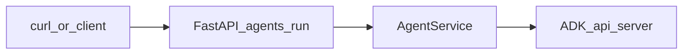
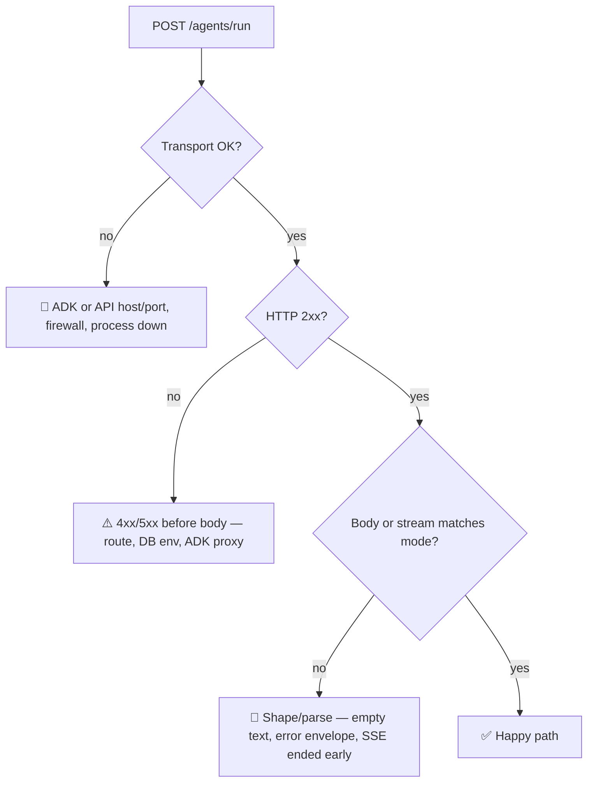

# Manual agent flow checklist

**Goal:** Validate [`app/services/agent_service.py`](../../app/services/agent_service.py) `AgentService` end-to-end (live ADK + httpx), using **`POST /agents/run`** as the integration harness (same path as [`app/api/agents_routes.py`](../../app/api/agents_routes.py)).



### Start here

- Default ports: **ADK** `8001` (`ADK_BASE_URL`), **API** `8000` (`make dev`).
- Start **backend** from `backend/`: `make dev` (needs `DATABASE_URL` in `.env`).
- Then **Step A** (ADK reachability) before any `/agents/run` curls.

---

## At a glance — this run

Fill **one row** after each smoke so readers see status without scrolling.

| Layer | Status | One-line why |
| --- | --- | --- |
| ADK reachable | ⬜ 🟢 / 🟡 / 🔴 | e.g. refused / HTTP 404 / OK |
| Backend API | ⬜ 🟢 / 🟡 / 🔴 | e.g. down / slow / OK |
| `mode: "text"` | ⬜ 🟢 / 🟡 / 🔴 | HTTP 200 + JSON key `"text"` (string; **empty OK** per service) |
| `mode: "json"` | ⬜ 🟢 / 🟡 / 🔴 | envelope + `status` |
| `mode: "sse"` | ⬜ 🟢 / 🟡 / 🔴 | stream + `Content-Type` |
| Validation (`user_id` empty) | ⬜ 🟢 / 🟡 / 🔴 | expect **422** |

**Legend:** 🟢 healthy · 🟡 acceptable but investigate · 🔴 wrong or blocked.



---

## Definition of PASS (order matters)

1. **ADK** responds on `ADK_BASE_URL` (any HTTP beats “connection refused”).
2. **Backend** `make dev` up with valid `DATABASE_URL` + `.env`.
3. **`text`:** HTTP **200** and JSON contains `"text"` (string; may be empty if ADK returns non-list body — see service).
4. **`json`:** HTTP **200** and `{"status":"success"|"error","data":{...}}` — on bad agent JSON or upstream `httpx.HTTPError`, `status` is `error` and `data` is `{}` (handler does not raise).
5. **`sse`:** HTTP **200**, `Content-Type: text/event-stream`, stream delivers lines or ends cleanly within `ADK_TIMEOUT_SECONDS`.
6. **Validation:** empty `user_id` → **422**.

**500 on `text`/`json` with ADK down** is upstream failure during `create_session` / `run_text`, not a bug in the JSON envelope path.

---

## AgentService coverage matrix

| Method | Exercised by | Assert |
| --- | --- | --- |
| `create_session()` | Every successful `/agents/run` (all `mode` values) | No 5xx before run/stream; ADK session response includes string `id` (opaque to curl; infer from success). |
| `run_text()` | `mode: "text"` | HTTP 200; JSON has `"text"` string (may be empty if ADK returns a non-list body; see service code). |
| `run_json()` | `mode: "json"` | HTTP 200; `{"status":"success"\|"error","data":{...}}`; on bad agent JSON or upstream `httpx.HTTPError`, `status` is `error` and `data` is `{}` (handler does not raise). |
| `stream_run_sse()` | `mode: "sse"` | HTTP 200; `Content-Type: text/event-stream`; non-empty stream or clean end per ADK; watch `ADK_TIMEOUT_SECONDS`. |
| `_run_payload` / `_sse_run_payload` | Indirectly | Successful `text` / `sse` calls imply ADK accepted the POST body shape. |

**Helpers** (`_text_from_event`, `_final_text_from_events`, `_parse_agent_json_object`, `envelope_success` / `envelope_error`): covered indirectly via `run_text` / `run_json` results—no need to import private symbols.

---

## Symptom → likely cause (read this when something breaks)

| You see | Likely cause |
| --- | --- |
| `curl: (7) Failed to connect` / HTTP `000` | ADK or API not listening; wrong host/port; firewall. |
| **500** + plain `Internal Server Error` on `text`/`json` | Upstream ADK/session/run failed before JSON envelope (`create_session` / `run_text` raises). |
| **422** on `/agents/run` | Request validation (`user_id` length, `mode`, etc.). |
| **200** + `{"text":""}` | ADK `/run` body was not a JSON **list** of events (`run_text`). |
| **200** + `{"status":"error","data":{}}` for `json` | `httpx.HTTPError` **or** assistant output was not a single JSON **object** — check API logs. |
| **200** + `text/event-stream` but `curl` exit **18** (outstanding read) | Upstream closed stream early (often ADK gone mid-stream). |
| `ValueError` / missing session `id` in logs | ADK session JSON missing string `id` after `raise_for_status`. |

---

## Environment (authoritative: `app/config.py`)

| Setting field | Env variable (typical) | Default |
| --- | --- | --- |
| `database_url` | `DATABASE_URL` | (required) |
| `adk_base_url` | `ADK_BASE_URL` | `http://127.0.0.1:8001` |
| `adk_app_name` | `ADK_APP_NAME` | `app` |
| `adk_timeout_seconds` | `ADK_TIMEOUT_SECONDS` | `300` |

**`.env.example` drift:** it still documents `AGENT_RUN_URL`, `AGENT_APP_NAME`, `AGENT_HTTP_TIMEOUT_SECONDS`, etc. Those names are **not** loaded by `Settings` today—use the table above when wiring `.env`.

**Agents route gate:** there is **no** `agent_smoke_enabled` flag in current settings; `/agents/run` is available whenever the API process is up. Treat that as a **security** consideration (see below).

---

## Step A — ADK (`agent-normalizer`)

- [ ] **Check** ADK is reachable (adjust host/port if `ADK_BASE_URL` differs):

  ```bash
  curl -sS -o /dev/null -w "%{http_code}\n" "${ADK_BASE_URL:-http://127.0.0.1:8001}/"
  ```

  Any non-connection-refused response is enough to proceed (exact status code depends on ADK version).

- [ ] **If down:** in your **agent-normalizer** clone, start the API server per that repo’s Makefile (see comment in `agent_service.py`: typically `make api`). Keep **port** aligned with `ADK_BASE_URL`.

---

## Step B — Backend API

- [ ] Export `DATABASE_URL` (and optional `ADK_*` overrides) in the shell or `.env` next to the app.

- [ ] From repo root `backend/`:

  ```bash
  make dev
  ```

  Default API: `http://127.0.0.1:8000` (override with `make dev PORT=...`).

---

## Step C — CLI smoke (`curl`)

Replace `8000` if you changed `PORT`.

### `run_text` (`mode: "text"`)

```bash
curl -sS -X POST "http://127.0.0.1:8000/agents/run" \
  -H "Content-Type: application/json" \
  -d '{"user_id":"smoke_user","prompt":"Reply with one short sentence.","mode":"text"}'
```

- [ ] HTTP **200**; body includes `"text"`.

**Optional (`jq`):** `... | jq -e 'has("text") and (.text|type=="string")' >/dev/null && echo OK_text_keys`

### `run_json` (`mode: "json"`)

Use a prompt that forces a **single JSON object** from the model (otherwise expect `status: "error"`).

```bash
curl -sS -X POST "http://127.0.0.1:8000/agents/run" \
  -H "Content-Type: application/json" \
  -d '{"user_id":"smoke_user","prompt":"Reply with exactly this JSON and nothing else: {\"ok\":true}","mode":"json"}'
```

- [ ] HTTP **200**; `status` is `success` or `error`; `data` is an object.

**Optional (`jq`):** `... | jq -e 'has("status","data") and (.data|type=="object")' >/dev/null && echo OK_json_envelope`

**Negative check (optional):** same call with a prompt that returns plain text or an array—expect `status: "error"`, `data: {}`.

### `stream_run_sse` (`mode: "sse"`)

```bash
curl -sS -N -X POST "http://127.0.0.1:8000/agents/run" \
  -H "Content-Type: application/json" \
  -d '{"user_id":"smoke_user","prompt":"Stream a few tokens.","mode":"sse"}'
```

- [ ] HTTP **200**; streaming body; cancel with Ctrl+C when satisfied.

If the stream stops immediately, compare with [Symptom → likely cause](#symptom--likely-cause-read-this-when-something-breaks) and `ADK_TIMEOUT_SECONDS` (long hangs = stuck upstream).

**Headers check (optional):** `curl -sS -D - -o /dev/null -N -X POST ... | grep -i '^content-type: text/event-stream'`

### Request validation (optional)

```bash
curl -sS -o /dev/null -w "%{http_code}\n" -X POST "http://127.0.0.1:8000/agents/run" \
  -H "Content-Type: application/json" \
  -d '{"user_id":"","prompt":"x","mode":"text"}'
```

- [ ] Expect **422** (empty `user_id` fails `min_length=1`).

---

## Optional: one-shot bash rubric

Copy-paste; prints HTTP codes and short labels. Does **not** replace reading bodies for `text`/`json`.

```bash
BASE="${BASE:-http://127.0.0.1:8000}"
ADK="${ADK_BASE_URL:-http://127.0.0.1:8001}"
TEXT_MODE_BODY_FILE="$(mktemp)"
JSON_MODE_BODY_FILE="$(mktemp)"
trap 'rm -f "$TEXT_MODE_BODY_FILE" "$JSON_MODE_BODY_FILE"' EXIT
printf "ADK root: "; curl -sS -o /dev/null -w "%{http_code}\n" "${ADK}/" || echo "(connect failed)"
printf "text: "; curl -sS -o "$TEXT_MODE_BODY_FILE" -w "%{http_code}\n" -X POST "$BASE/agents/run" -H "Content-Type: application/json" -d '{"user_id":"smoke_user","prompt":"One word: ok","mode":"text"}' || true
printf "json: "; curl -sS -o "$JSON_MODE_BODY_FILE" -w "%{http_code}\n" -X POST "$BASE/agents/run" -H "Content-Type: application/json" -d '{"user_id":"smoke_user","prompt":"Reply with exactly this JSON and nothing else: {\"ok\":true}","mode":"json"}' || true
printf "validate: "; curl -sS -o /dev/null -w "%{http_code}\n" -X POST "$BASE/agents/run" -H "Content-Type: application/json" -d '{"user_id":"","prompt":"x","mode":"text"}' || true
command -v jq >/dev/null 2>&1 && jq -e 'has("text")' "$TEXT_MODE_BODY_FILE" >/dev/null 2>&1 && echo "  (jq: text key OK)" || echo "  (jq: skip or text shape check failed)"
command -v jq >/dev/null 2>&1 && jq -e 'has("status","data")' "$JSON_MODE_BODY_FILE" >/dev/null 2>&1 && echo "  (jq: json envelope keys OK)" || echo "  (jq: skip or json shape check failed)"
```

---

## “Good” checklist (quick)

- [ ] ADK up; backend `make dev` healthy.
- [ ] `text` → `create_session` + `run_text` path OK.
- [ ] `json` → `create_session` + `run_json` envelope OK (success path; optional error path).
- [ ] `sse` → `create_session` + `stream_run_sse` streams without immediate 5xx.

---

## Report (fill in — keep this section current)

**Split rule:** put **your** latest numbers here; move old runs to [Appendix: archived example runs](#appendix-archived-example-runs) so operators never confuse stale 🔴 with today’s environment.

### Summary

- Date: _YYYY-MM-DD_
- Overall: _PASS / PARTIAL / FAIL — one clause why_

### Results

| AgentService area | Step / `mode` | HTTP | Shape OK? (Y/N) | Notes |
| --- | --- | --- | --- | --- |
| `create_session` | all | | | |
| `run_text` | `text` | | | |
| `run_json` | `json` | | | |
| `stream_run_sse` | `sse` | | | |
| _(FastAPI validation)_ | empty `user_id` | | | expect 422 |

### Issues (wrong / broken)

- 

### Inefficiencies (slow, noisy, redundant)

- 

### Safety / risk (pre-filled; extend if you observe more)

- **`/agents/run` is not authenticated** in this router; anyone who can reach the API can proxy prompts to ADK and burn quota.
- **`user_id` is caller-controlled** and forwarded to ADK session paths—do not treat as trusted identity without gateway auth.
- **`run_json` swallows** upstream `httpx.HTTPError` into `status: "error"`—callers must inspect `status`, not only HTTP 200.
- **SSE** holds a connection for the model run; combined with long httpx timeouts, this is a DoS surface if exposed broadly.
- **No feature flag** in current `Settings`: agents routes are on whenever the app runs—lock down network / add auth before any shared deployment.

---

## Appendix: archived example runs

### 2026-05-13 — automated workspace run (**both** ADK and backend **down**)

_Re-checked same day (automated): ADK `000`, API `000` — still nothing listening on defaults._

**What we ran:** Step A root `curl` + `POST /agents/run` `text`; TCP refused before HTTP — `curl -w` prints **`000`**, not 500.

**At a glance**

| Layer | Status | One-line why |
| --- | --- | --- |
| ADK reachable | 🔴 | `127.0.0.1:8001` connection refused |
| Backend API | 🔴 | `127.0.0.1:8000` connection refused |
| `mode: "text"` | 🔴 | no TCP to API (`000`) |
| `mode: "json"` | ⬜ | not run (same blocker) |
| `mode: "sse"` | ⬜ | not run (same blocker) |
| Validation | ⬜ | not run (same blocker) |

**Results (honest for this scenario)**

| AgentService area | Step / `mode` | HTTP | Shape OK? (Y/N) |
| --- | --- | --- | --- |
| `create_session` | all | — / `000` | N (never reached ADK) |
| `run_text` | `text` | `000` | N (could not connect to API) |
| `run_json` | `json` | — | not run |
| `stream_run_sse` | `sse` | — | not run |
| _(FastAPI validation)_ | empty `user_id` | — | not run |

**Contrast — API up, ADK down:** Step C calls return **500** from FastAPI after `create_session`/`run_text` raises on dead ADK; SSE may show **200** + truncated stream (`curl` exit **18**). Use the [symptom table](#symptom--likely-cause-read-this-when-something-breaks) to tell the two worlds apart.

---

## Done

Hand this file back with the **Report** tables filled when the smoke run finishes; copy prior runs to the appendix.
